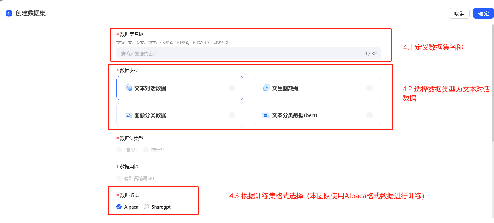

# 项目说明

本项目旨在处理和分析多个数据集，并将其转换为适合模型训练和推理的格式。以下是项目的详细说明和使用方法。

## 项目结构

```
sciER-LLM/
├── data/
│   ├── raw/
│   │   ├── train/
│   │   ├── test/
│   ├── processed/
│   │   ├── train/
│   │   ├── test/
│   ├── inference/
│   │   ├── input/
│   │   ├── output/
│   ├── alpaca/
│   ├── stat/
├── submit/
├── dataset_prompts.json
├── njust_split.py
├── njust_merge.py
├── output_format.py
├── output_merge.py
├── stat_analysis.py
├── test2inference.py
├── train2alpaca.py
```

## 使用方法

### 1. 数据描述性统计

首先，运行 `stat_analysis.py` 脚本，对数据集进行描述性统计分析。该脚本会在 `stat` 文件夹下生成 4 个数据集的文本长度和标签统计信息。

```bash
python stat_analysis.py
```
#### 1.1 istic数据集
##### 1.1.1 训练数据长度分布

##### 1.1.2 训练数据标签统计

###### 1.1.2.1 实体标签统计

|  实体名称  |         数目         | 
|:------:|:------------------:| 
| Evaluation-Metric  |        5073        | 
| Method  |   12713   |
|  Task   | 3909 | 
|  Material   | 1582 | 


###### 1.1.2.2 关系标签统计
|       关系名称        |  数目  | 
|:-----------------:|:----:| 
| evaluate-for | 6787 | 
|      used-for       | 5459 |
|       Equal        | 1605 | 
|     part-of      | 5144 | 
|     compare      | 1848 | 
|     conjunction      | 331  | 
|     feature-of      |  4   | 

#### 1.2 las数据集
##### 1.2.1 训练数据长度分布


##### 1.2.2 训练数据标签统计

###### 1.2.2.1 实体标签统计
|  实体名称  |  数目  | 
|:------:|:----:| 
| Reactant  | 3072 | 
| Solvent  | 234  |
|  Condition  | 1463 | 
|  Catalyst   | 439  | 
| Reaction  | 779  | 
|Inorganic  | 516  |
|  Organic  | 647  | 
| Product  |  34  |
|  Method  |  15  |
| Unspecified  |  8   |
| Created from  |  3   |
| Institution  |  3   | 
|Materials |  2   |
|  non-chemical entity   |  1   |
|Person  |  1   |
|  Location  |  1   |
|  Civilization  |  1   | 
| Tool  |  1   | 

###### 1.1.2.2 关系标签统计
|       关系名称        |  数目  | 
|:-----------------:|:----:| 
| Used in | 1294 | 
|      Created by       | 834  |
|       Along with        | 290  | 
|     Created from      | 1447 | 
|     Created in      |  2   | 
|     Examined by      |  2   | 
|     Used with      |  1   | 

#### 1.3 njust数据集

##### 1.3.1 训练数据长度分布


##### 1.3.2 训练数据标签统计
###### 1.3.2.1 实体标签统计
|  实体名称  |  数目  | 
|:------:|:----:| 
| Method  | 2087 | 
|Dataset | 676  |
|  Metric  | 731  | 
|  Tool   | 147  | 


#### 1.4 whu数据集

##### 1.4.1 训练数据长度分布


##### 1.4.2 训练数据标签统计

###### 1.4.2.1 实体标签统计
|  实体名称  |  数目  | 
|:------:|:----:|
| Effect  | 1420 |
| Operation  | 1249 | 


###### 1.4.2.2 关系标签统计
|       关系名称        |  数目  | 
|:-----------------:|:----:| 
| Positive | 1004 | 
|      Other       | 273  |
|      Negative       | 112  | 


### 2. 数据预处理
#### 2.1 文本切分

发现 `njust` 数据集的文本过长，需要按照 10 句话进行切分。运行 `njust_split.py` 脚本，在 `data/processed` 文件夹下生成切割后的训练集和测试集。

```bash
python njust_split.py
```

#### 2.2 标签更新

发现`las`数据集的实体及关系标签存在错误，如`entity`中包含`Person`, `Location`等标签，且出现次数相较于正确标签极低。因此将训练集`entity`与`relation`中出现次数小于10次的标签删除

### 3. 转换训练数据格式

运行 `train2alpaca.py` 脚本，将训练数据转换为 `alpaca.json` 格式，生成的文件保存在 `data/alpaca` 文件夹下。

```bash
python train2alpaca.py
```

`alpaca.json` 格式如下：

```json
{
  "instruction": "user instruction (required)",
  "input": "user input (optional)",
  "output": "model response (required)"
}
```

### 4. 模型训练

通过讯飞星辰MaaS平台进行模型创建、训练和推理，前往平台地址：[https://training.xfyun.cn/modelSquare](https://training.xfyun.cn/modelSquare)。以下是各数据集的模型参数：

| 数据集 | 模型 | learning_rate | epoch | max_length | lora作用模块 | lora_dropout | lora_alpha | Lora是否合并 |
| ------ | ---- | ------------- | ----- | ---------- | ------------ | ------------ | ---------- | -------------- |
| istic  | Gemma2-9b-it | 8e-5 | 5 | 2048 | all | 0.1 | 32 | 关 |
| njust  | Gemma2-9b-it | 3e-5 | 5 | 2048 | all | 0.1 | 32 | 关 |
| whu    | llama3-8b-instruct | 5e-5 | 3 | 4096 | all | 0.5 | 32 | 关 |
| las    | llama3-8b-instruct | 5e-5 | 3 | 4096 | all | 0.1 | 32 | 关 |

#### 4.1 微调设置





#### 4.2 模型发布


#### 4.3 模型推理


### 5. 转换测试数据格式

运行 `test2inference.py` 脚本，将测试数据转换为推理的 `jsonl` 格式，生成的文件保存在 `data/inference/input` 文件夹下。

```bash
python test2inference.py
```

`jsonl` 格式如下：

```json
{
  "id": "文档id",
  "input": "提示词+文档文本",
  "target": ""
}
```

### 6. 推理参数

以下是各数据集的推理参数：

| 数据集 | Temperature | Top_k | Max tokens |
| ------ | ----------- | ----- | ---------- |
| istic  | 0.1         | 1     | 2048       |
| njust  | 0.1         | 1     | 2048       |
| whu    | 0.1         | 1     | 2048       |
| las    | 0.1         | 1     | 2048       |

### 7. 合并推理结果

运行 `njust_merge.py` 脚本，将推理返回结果合并。

```bash
python njust_merge.py
```

### 8. 转换推理结果格式

运行 `output_format.py` 脚本，将推理结果的 `jsonl` 转换为比赛方要求的 `json` 格式，保存在 `submit/result` 文件夹下。

```bash
python output_format.py
```

`json` 格式如下：

```json
{
  "id": "文档id",
  "result": [
    {
      "value": {
        "start": "起始字符位置",
        "end": "结束字符位置",
        "text": "实体文本1",
        "labels": ["实体类型1"]
      },
      "id": "实体1的标识"
    },
    {
      "value": {
        "start": "起始字符位置",
        "end": "结束字符位置",
        "text": "实体文本2",
        "labels": ["实体类型2"]
      },
      "id": "实体2的标识"
    },
    {
      "from_id": "实体m的标识",
      "to_id": "实体n的标识",
      "type": "relation",
      "labels": ["实体关系1"]
    },
    {
      "from_id": "实体m的标识",
      "to_id": "实体n的标识",
      "type": "relation",
      "labels": ["实体关系2"]
    }
  ],
  "data": {
    "text": "xxxx"
  }
}
```

### 9. 合并所有数据集文件

最后，运行 `output_merge.py` 脚本，将 4 个数据集文件合并。得到最终提交文件`灵犀解语.json` 

```bash
python output_merge.py
```

### 10. 提示词文件

项目中包含一个 `dataset_prompts.json` 文件，定义了 4 个数据集的提示词。该文件的内容如下：

```json
{
    "istic": "[Task] Extract the following entities and relations from the text: Entities: 1. Evaluation-Metric 2. Method 3. Task 4. Material; Relations: 1. evaluate-for 2. used-for 3. equal 4. part-of 5. compare 6. conjunction 7. feature-of. [Format] {\"Entities\": {\"entity\":\"label\"}, \"Relations\": {\"<Head Entity, Tail Entity>\":\"relation\"}}. [Constraints] 1. Use only the specified labels. 2. All entities in \"Relations\" must exist in \"Entities\". 3. Ensure all entities and relations are directly verifiable from the text.",
    "las": "[Task] Extract the following entities and relations from the text: Entities: 1. Reactant 2. Solvent 3. Condition 4. Catalyst 5. Reaction 6. Inorganic 7. Organic; Relations: 1. Used in 2. Created by 3. Along with 4. Created from. [Format] {\"Entities\": {\"entity\":\"label\"}, \"Relations\": {\"<Head Entity, Tail Entity>\":\"relation\"}}. [Constraints] 1. Use only the specified labels. 2. All entities in \"Relations\" must exist in \"Entities\". 3. Ensure all entities and relations are directly verifiable from the text.",
    "whu": "[Task] Extract the following entities and relations from the text: Entities: 1. Operation 2. Effect; Relations: 1. Positive 2. Negative 3. Other. [Format] {\"Entities\": {\"entity\":\"label\"}, \"Relations\": {\"<Head Entity, Tail Entity>\":\"relation\"}}. [Constraints] 1. Use only the specified labels. 2. All entities in \"Relations\" must exist in \"Entities\". 3. Ensure all entities and relations are directly verifiable from the text.",
    "njust": "[Role]: You are an advanced information extraction system.\n[Task]: Extract the following entities from the text.\nEntities:\n1. Method: Techniques or algorithms used to solve specific problems or tasks. Examples: SVM, LSTM, BERT, Adam, RNN.\n2. Dataset: Collections of data used for training or evaluation. Examples: Brown Corpus, Penn Treebank, WordNet.\n3. Metric: Standards for measuring the performance of models. Examples: Accuracy, Precision, Recall, F1-score, BLEU.\n4. Tool: Software or frameworks used in the research process. Examples: Python, GIZA++, TensorFlow, PyTorch.\n[Format]: {\"entity\":\"label\"}\n[Constraints]:\n1. Use only the specified labels.\n2. Ensure all entities are directly verifiable from the text."
}
```

## 结语

通过以上步骤，您可以完成数据集的处理、转换和合并，生成适合模型训练和推理的格式文件。如果您有任何问题，请随时联系我。